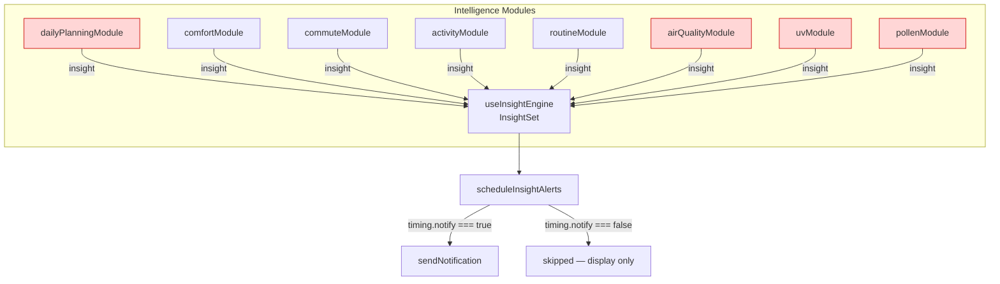

# Design Document: Phase 3.4 Notification Activation

## Overview

Phase 3.4 activates push-notification delivery end-to-end in LumiCast by correcting `timing.notify` values in four intelligence modules. The infrastructure (`scheduleInsightAlerts`, `createInsight`, `useInsightEngine`) is already fully wired. This is a targeted, surgical change: four one-line or two-line fixes across four files, plus a test suite that verifies the policy invariant across the entire system.

The changes are:

1. **`dailyPlanningModule.js`** — Remove the erroneous `notify: true` on the cold `USEFUL` branch.
2. **`airQualityModule.js`** — Add `notify: isSensitive` to the heads-up `createInsight` call.
3. **`uvModule.js`** — Add `notify: isSensitive` to the heads-up `createInsight` call.
4. **`pollenModule.js`** — Add `notify: isSensitive` to the heads-up `createInsight` call.

After these changes, `scheduleInsightAlerts()` will dispatch real push notifications for the first time.

## Architecture



Red modules = changed in this spec. All other modules pass through unchanged.

## Components and Interfaces

### Affected Module Interfaces

All four affected modules are pure functions with the signature:

```js
function moduleXxx(weatherData: WeatherData, userContext: UserContext): Insight | null
```

None of their external interfaces change. The only change is the value passed to the `notify` parameter of `createInsight()` inside each module.

### createInsight factory (unchanged)

```js
// insightValidator.js — no changes
createInsight({
  type, urgency, content, actionPath,
  notify: boolean,   // ← the field being corrected in affected modules
  ...
})
// Produces: { timing: { notify: boolean, ... }, ... }
```

### scheduleInsightAlerts (unchanged)

```js
// useWeatherNotifications.js — no changes
function scheduleInsightAlerts(insightSet, prefs) {
  for (const insight of insightSet) {
    if (!insight?.timing?.notify) continue  // ← gate Phase 3.4 activates
    // dispatch push notification
  }
}
```

## Data Models

### Notify Flag Policy Table

The complete policy across all eight modules after Phase 3.4:

| Module | Scenario | Urgency | `notify` |
|---|---|---|---|
| dailyPlanningModule | Thunderstorm | alert | `true` |
| dailyPlanningModule | Rain (active or incoming) | heads-up | `true` |
| dailyPlanningModule | Heat — alert | alert | `true` |
| dailyPlanningModule | Heat — heads-up | heads-up | `true` |
| dailyPlanningModule | Heat — useful | useful | `false` ✓ |
| dailyPlanningModule | Cold — alert | alert | `true` |
| dailyPlanningModule | Cold — heads-up | heads-up | `true` |
| **dailyPlanningModule** | **Cold — useful** | **useful** | **`false` ← BUG FIX** |
| dailyPlanningModule | Wind | heads-up/alert | `true` |
| dailyPlanningModule | Benign / far-rain | ambient/useful | `false` ✓ |
| comfortModule | Heat+humidity alert | alert | `true` ✓ |
| comfortModule | Heat+humidity heads-up | heads-up | `false` (default) ✓ |
| comfortModule | UV alert | alert | `true` ✓ |
| comfortModule | UV heads-up | heads-up | `false` (default) ✓ |
| commuteModule | All scenarios | heads-up/alert | `true` ✓ |
| activityModule | Alert not-recommended | alert | `true` ✓ |
| activityModule | Heads-up not-recommended | heads-up | `true` ✓ |
| activityModule | Marginal/useful | useful | `false` (default) ✓ |
| activityModule | Ambient good | ambient | `false` (default) ✓ |
| routineModule | All actionable scenarios | heads-up/alert | `true` ✓ |
| **airQualityModule** | **Heads-up** | **heads-up** | **`isSensitive` ← NEW** |
| airQualityModule | Alert | alert | `true` ✓ |
| airQualityModule | Useful | useful | `false` (default) ✓ |
| **uvModule** | **Heads-up** | **heads-up** | **`isSensitive` ← NEW** |
| uvModule | Alert | alert | `true` ✓ |
| uvModule | Useful | useful | `false` (default) ✓ |
| **pollenModule** | **Heads-up** | **heads-up** | **`isSensitive` ← NEW** |
| pollenModule | Alert | alert | `true` ✓ |

### Exact Code Changes

#### dailyPlanningModule.js — cold USEFUL branch

```diff
- // USEFUL heat — just a note
+ // USEFUL cold — note only, no notification
  return createInsight({
      type: 'daily-planning',
      urgency: coldUrgency,          // coldUrgency is USEFUL here
      content: `Cold conditions today.${warmerStr}`,
      actionPath: `Dress in layers...`,
      confidence: warmerSlot ? 'high' : 'medium',
-     notify: true,                  // BUG: USEFUL should not notify
+     notify: false,                 // FIXED: USEFUL tier is display-only
      usedSensitivity: !!sensitivities?.cold,
      usedLocation: hasLocation
  })
```

#### airQualityModule.js — heads-up branch

```diff
  if (urgency === URGENCY.HEADS_UP) {
      return createInsight({
          type: 'environmental',
          subtype: 'air-quality',
          urgency: URGENCY.HEADS_UP,
          content: `Air quality is reduced today...`,
          actionPath: isSensitive ? '...' : '...',
          confidence: 'high',
+         notify: isSensitive,       // notify only when user declared airQuality sensitivity
          usedSensitivity: isSensitive,
          usedLocation: hasLocation
      })
  }
```

#### uvModule.js — heads-up branch

```diff
  if (urgency === URGENCY.HEADS_UP) {
      return createInsight({
          type: 'environmental',
          subtype: 'uv',
          urgency: URGENCY.HEADS_UP,
          content: `UV is elevated today...`,
          actionPath: isSensitive ? '...' : '...',
          confidence: 'high',
+         notify: isSensitive,       // notify only when user declared UV sensitivity
          usedSensitivity: isSensitive,
          usedLocation: hasLocation
      })
  }
```

#### pollenModule.js — heads-up branch

```diff
  // ── 2. Heads-up ──────────────────────────────────────────────────────────
  return createInsight({
      type: 'environmental',
      subtype: 'pollen',
      urgency: URGENCY.HEADS_UP,
      content: `Pollen count is ${levelLabel} today...`,
      actionPath: isSensitive ? '...' : '...',
      confidence: 'medium',
+     notify: isSensitive,           // notify only when user declared pollen sensitivity
      usedSensitivity: isSensitive,
      usedLocation: hasLocation
  })
```

## Correctness Properties

*A property is a characteristic or behavior that should hold true across all valid executions of a system — essentially, a formal statement about what the system should do. Properties serve as the bridge between human-readable specifications and machine-verifiable correctness guarantees.*

**Property reflection:** After analyzing all acceptance criteria, 12 individual criteria map to testable properties. These consolidate into 3 non-redundant properties:
- Criteria 1.1, 2.4, 3.4, 5.1, 5.2 all express the same "useful/ambient never notifies" invariant → Property 1
- Criteria 2.1, 2.2, 3.1, 3.2, 4.1, 4.2 all express the "environmental heads-up follows isSensitive" rule → Property 2
- Criteria 1.2, 1.3, 2.3, 3.3, 4.3, 5.3 all express "alert always notifies" → Property 3

### Property 1: Useful and ambient insights never trigger notifications

*For any* insight produced by any intelligence module at urgency `useful` or `ambient`, `timing.notify` SHALL be `false`.

**Validates: Requirements 1.1, 2.4, 3.4, 5.1, 5.2**

### Property 2: Environmental heads-up notification follows isSensitive exactly

*For any* environmental module (`airQualityModule`, `uvModule`, `pollenModule`) producing a heads-up insight, `timing.notify` SHALL equal the value of `isSensitive` for the relevant domain — `true` when the user declared that sensitivity, `false` otherwise.

**Validates: Requirements 2.1, 2.2, 3.1, 3.2, 4.1, 4.2**

### Property 3: Alert insights always notify

*For any* insight produced at urgency `alert` by any intelligence module, `timing.notify` SHALL be `true`.

**Validates: Requirements 1.2, 1.3, 2.3, 3.3, 4.3, 5.3**

## Error Handling

This feature introduces no new error surface. All four changes are single-field assignments inside existing `createInsight()` calls that are already inside try/catch-guarded module execution paths in `useInsightEngine`.

The only runtime risk is a regression — a module emitting a notification for a non-alertable insight tier. The correctness properties above, enforced by property-based tests, provide the regression guard.

## Testing Strategy

### Dual Testing Approach

**Unit tests** verify the specific changed scenarios by example:
- `dailyPlanningModule`: cold at USEFUL urgency → `notify: false`
- `airQualityModule`: heads-up with `isSensitive = true` → `notify: true`; with `isSensitive = false` → `notify: false`
- `uvModule`: same as airQualityModule pattern
- `pollenModule`: same pattern

**Property-based tests** verify the universal policy invariant across all input combinations:
- Property 1: useful/ambient → `notify === false` for all modules
- Property 2: environmental heads-up → `notify === isSensitive`
- Property 3: alert → `notify === true`

### Property-Based Testing Library

Use **[fast-check](https://github.com/dubzzz/fast-check)** (already a natural fit for the project's JavaScript/Vitest stack).

Each property test must run a minimum of **100 iterations**.

Tag format: `// Feature: phase-34-notification-activation, Property N: <property text>`

### Test File Locations

Tests follow the existing project pattern (co-located `__tests__` directories):

- `src/intelligence/modules/__tests__/dailyPlanningModule.notify.test.js`
- `src/intelligence/modules/__tests__/airQualityModule.notify.test.js`
- `src/intelligence/modules/__tests__/uvModule.notify.test.js`
- `src/intelligence/modules/__tests__/pollenModule.notify.test.js`
- `src/intelligence/modules/__tests__/notifyPolicy.pbt.test.js` (cross-module property tests)

### Unit Test Scope Per Module

**dailyPlanningModule**:
- Cold USEFUL: `feelsLike` in the useful-but-not-heads-up range (e.g. `feelsLike = 5°C` where `escalateCold` returns `USEFUL`) → `notify === false`
- Cold HEADS_UP: `feelsLike` at heads-up threshold → `notify === true`
- Cold ALERT: `feelsLike` at alert threshold → `notify === true`
- Confirm no regression on thunderstorm / rain / heat / wind paths

**airQualityModule**:
- Alert, any sensitivity → `notify === true`
- Heads-up, `isSensitive = true` → `notify === true`
- Heads-up, `isSensitive = false` → `notify === false`
- Useful, any sensitivity → `notify === false`

**uvModule**: Same pattern as airQualityModule.

**pollenModule**:
- Alert, any sensitivity → `notify === true`
- Heads-up, `isSensitive = true` → `notify === true`
- Heads-up, `isSensitive = false` → `notify === false`

### Property-Based Test Design

```js
// Property 1: useful/ambient NEVER notify
fc.assert(fc.property(
  fc.record({ /* weather data generators */ }),
  (weatherData) => {
    const insight = moduleXxx(weatherData, baseUserContext)
    if (!insight) return true
    if (insight.urgency === 'useful' || insight.urgency === 'ambient') {
      return insight.timing.notify === false
    }
    return true
  }
), { numRuns: 100 })
```

The cross-module PBT file runs Property 1 against all eight modules by importing each module function and running the same generator-driven assertion loop.
